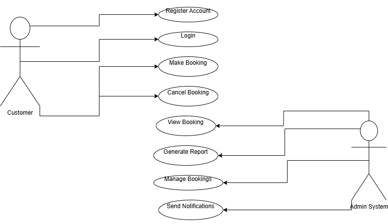

# Requirement Analysis in Software Development

## Introduction

This repository is dedicated to exploring and documenting the process of requirement analysis in software development projects. Requirement analysis is a crucial phase in the software development lifecycle where the needs and expectations of stakeholders are gathered, analyzed, and clearly defined to guide the development process.

In this repository, you’ll find structured notes, examples, templates, and resources aimed at understanding the importance of effective requirement analysis and how it contributes to building successful software solutions.
## What is Requirement Analysis?
Requirement analysis is a critical phase in the software development lifecycle where the project team gathers, analyzes and defines the requirements of the software product to e developed.
### Why is Requirement Analysis Important?:
- **Clarity and Understanding**-Helps to understand what the stakeholders expect from the software reducing ambiguity.
- **Scope definition**-Clearly defines scope of the project preventing scope creep.
- **Basis for design and development**-Provides a solid foundation for designing and developing the system.
- **Cost and time estimation.**
- **Quaity assurance.**

  ## Key Activities in Requirement Analysis

- **Requirement Gathering:**  
  This involves collecting requirements from all relevant stakeholders, including clients, end-users, and technical teams. It ensures that every expectation and need for the software is noted before development begins.Examples of ways to gather requirements:( interviews, surveys, workshops, oservation, document analysis.)

- **Requirement Elicitation:**  
  This is the process of drawing out the actual requirements through techniques such as interviews, questionnaires, workshops, brainstorming sessions, and observations. It helps uncover both stated and unstated needs. (brainstorming, focuss groups, prototyping)

- **Requirement Documentation:**  
  All gathered and elicited requirements are documented clearly and systematically. This serves as a formal reference throughout the software development lifecycle and helps maintain alignment between the development team and stakeholders.

- **Requirement Analysis and Modeling:**  
  Here, the documented requirements are carefully analyzed for completeness, feasibility, consistency, and clarity. In some cases, models like data flow diagrams (DFDs) or use case diagrams are created to visualize the system's behavior and structure.(requirement prioritization, feasibility analysis, modelling)

- **Requirement Validation:**  
  The final activity involves verifying and validating the documented requirements with stakeholders to ensure they accurately reflect their needs and are achievable. This step helps identify any misunderstandings or gaps before development begins.(requirment approval, acceptance criteria, traceability)

## Types of Requirements
### Functional Requirements
Describe what the system should do.
**Examples**
- User registration
- Property Listings
- Booking systems
- User Authentication
### Non-functional Requirements
Describe how the system should perform.
 **Examples**
- Performance
- Security
- Scalability
- Usability
- Reliabitlity
## Use Case Diagrams
Use Case Diagrams show how different users interact with the system to achieve specific goals.
### Benefits of Use Case Diagrams:
- Provide clear visual representation of the system functionalities.
- Help in identifying and organizing system requirements.
- Facilitate communication between stakeholders and development team.
### Use Case Diagram for the Booking Management System:
Below is the use case diagram illustrating the main interactions between the system and its users:

## Acceptance Criteria
Acceptance Criteria are conditions that a feature must meet to be accepted by the stakeholders.

### Benefits of Acceptance Criteria in Requirement Analysis:
- Ensures all parties have a clear understanding of features requirements.
- Provide a basis for testing and validation.
- Help in maintaining quality and meeting user expectations.
### Example: Acceptance Criteria for **Checkout Feature** in the Booking Management System

**Feature:** Allow users to checkout and confirm their booking.

**Acceptance Criteria:**
- The system should allow a user to view all booking details before confirming checkout.
- The user must be able to select a payment method (e.g., card, mobile money, or cash).
- The system should validate that all required user information is filled in before proceeding.
- The user should receive a confirmation message after a successful checkout.
- A confirmation email containing the booking details must be sent to the user’s email address immediately after checkout.
- The system should display an error message if payment fails or if mandatory details are missing.

